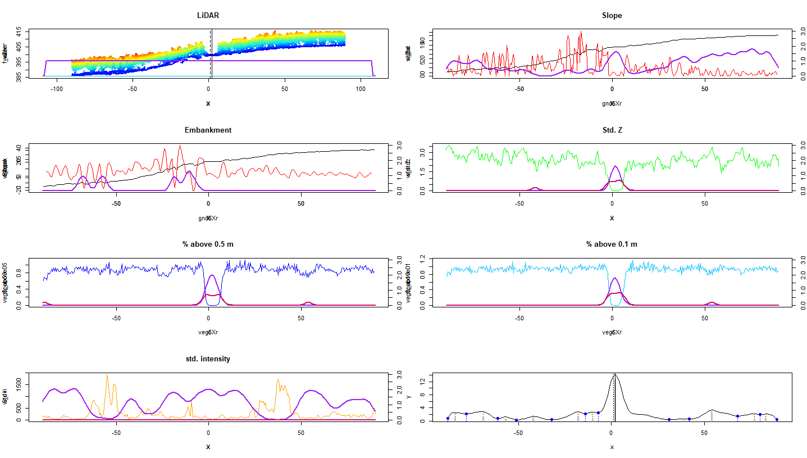
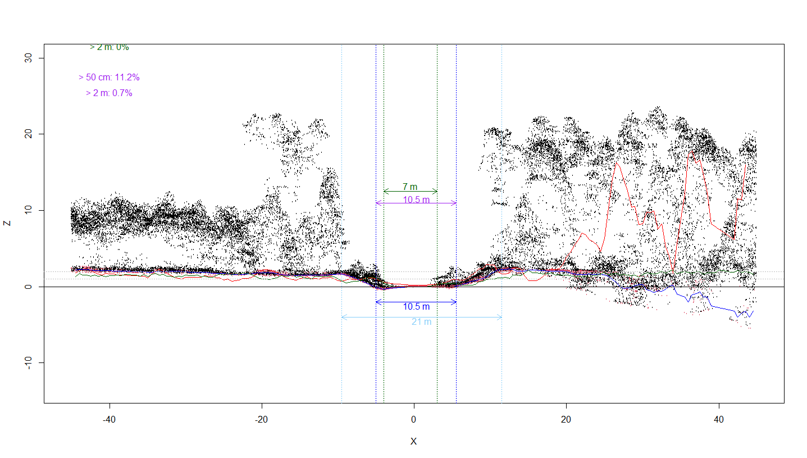
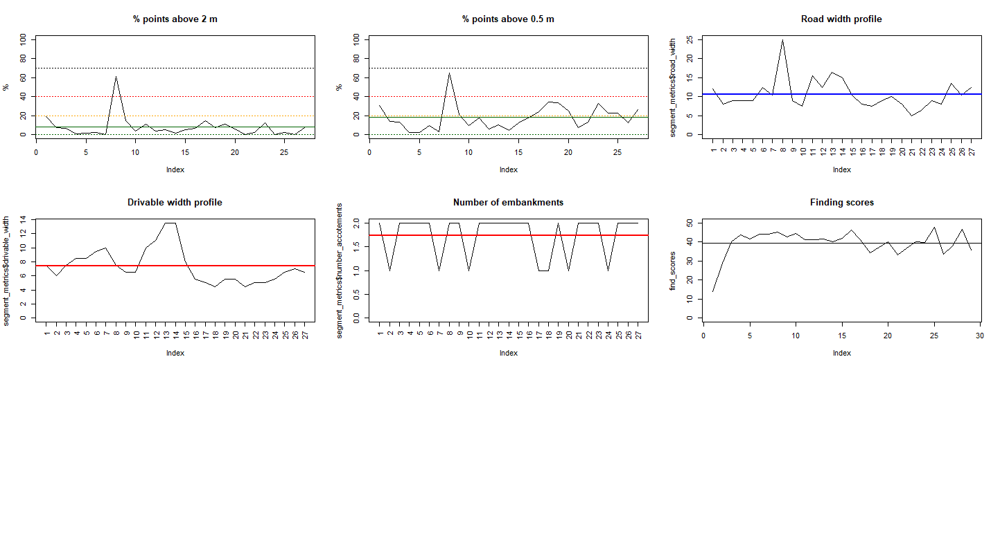

# Demonstration {-#demo}

[Jean-Romain](#jrr) - in partnership with the Quebec ministry - has been developing approaches to detect, measure, and evaluate road detection from lidar data. His approach leverages the [lidR](https://github.com/Jean-Romain/lidR) package, which has seen massive uptake and use globally. lidR, also developed by Jean-Romain, is free and open source and is considered a key resource for lidar data processing globally. 

## Algorithm overview {-#alg}

The implementation of this algorithm is a work in progress. Function names are likely to change, methods are likely to evolve, and debug options are likely to be removed. Simply described, the current road detection and measurement algorithm `measure_road()` leverages the lidR processing engine to extract relevant segments of lidar data from a point-cloud with a paired linear road network. The approach is in ongoing development, but follows the following steps:

1. A lidar dataset and road segment and provided

2. The road segment is buffed and used to clip relevant lidar data

3. The road is divided into incremental segments

3. Structural lidar metrics are calculated at each segment used to define the location with the highest probability for the road

5. Important road measurements are calculated including drivable width and embankment width.

4. If the algorithm is confident that the road exists, a new (corrected) road segment is produced.

## Example road {-#ex}

This example uses a 1 km^2^ section of SPL data and road network shapefile from the [Romeo Malette](-#romeo) forest.

```{r,warning=FALSE,message=FALSE}
#--- load in required libraries ---#
library(lidR)
library(sf)
library(MFFProads)
library(dplyr)
library(leaflet)

#--- read in laz and road shapefile ---#
ctg <- readLAScatalog("F:/_2021_MFPProads/RMF/RMF_roads_SPL/tst/split")
shp <- st_read("F:/_2021_MFPProads/RMF/RMF_roads_SPL/tst/roads_.shp",quiet=TRUE)

mapview::mapview(list(ctg,shp), layer.name = c("catalog","roads"),
                 color = "red", map.type = "Esri.WorldImagery")

```

## Detect road and calculate metrics {-#detectandcalc}

Individual road segments can be visualized alongside co-located SPL data.

```{r}
#--- test on single road ---#
roadx <- shp %>%
  dplyr::filter(OBJECTID == 29976)

```

```{r, echo = FALSE}
m2 <- mapview::mapview(list(ctg,roadx), layer.name = c("catalog","road"),
                 color = "red", map.type = "Esri.WorldImagery")

coords <- c(-81.89471,
            47.93648)

m2@map %>% setView(coords[1], coords[2], zoom = 17)

```

## Detecting the road {-#detect}

We define that we want to find the road using `options()`. An example of how data are visualized is provided below. Note the different metrics used. A spike in the purple lines denotes an increased probability of road for a given point in the transect.

```{r,eval=FALSE}
#--- find the roads ---#
res1 <- measure_road(roadx, ctg, mffproads_default_parameters, relocate = TRUE)
```



## Measuring the road {-#measure}

Following detection of the road the algorithm can also measure important road parameters.



## Derive road metrics {-#metrics}

Metrics about the road can also be measured, giving details about drivable quality and embankments. A final _STATE_ of the roads is provided with the following gradient:

1. Road exists, very confident
2. Road exists, some confusion
3. Road doesnt exist, some confusion
4. Road doesnt exist




```{r}
#--- show road output ---#

res1

res$STATE
```