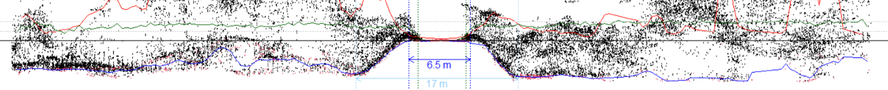

--- 
title: "Automated Road and Attribute Extraction from SPL Data"
author: "Tristan RH Goodbody, Nicholas Coops, Jean-Romain Roussel"
date: "`r Sys.Date()`"
site: bookdown::bookdown_site
documentclass: book
bibliography: [book.bib, packages.bib]
biblio-style: apalike
link-citations: no
description: "This projet has been funded by the Enhanced Forest Resource Inventory Knowledge Transfer & Tool Development Program through the FOrestry Futures Trust of Ontario."
---

```{r, include=FALSE}
knitr::opts_chunk$set(echo = TRUE)
```

# Overview {-#overview}

This document is a brief introduction to the _automated road and attribute extraction_ project being led by [Dr. Nicholas Coops](#ncc) of the Integrated Remote Sensing Studio at the UBC Faculty of Forestry, and [Alexis Achim](#aa) from Laval University's Renewable Material Research Centre. Herein we:

* Introduce [project leads and team members](#people)

* Summarize [project themes and methods](#projoverview)

* Describe [study sites](#sites)

* Provide a short [demo of current methods](#demo)

## Project summary {-#summary}

Forest roads are an essential prerequisite for forestry, and their activation and de-activation are critical decision points for management and biodiversity conservation. Provision of single photon LiDAR (SPL) data to enhance forest management and inventory frameworks has raised pertinent questions about the potential to use these data for improving knowledge of road network coverage.

The aims of this project are to:

1. _Develop and validate new automatized approaches to accurately locate forest roads across Ontario from SPL data_

2. _To predict the condition (or attributes) of both active and decommissioned forest roads from SPL._ 

The methodologies will be open-access, through the R and python scripting languages, to enable users to gain direct access to the approaches, and apply them to update, classify and attribute road layers across Ontario.

## Project partners {-#partners}

This project is principally a partnership between University of British Columbia, Laval University and Nipissing University, with the Province of Ontario, RYAM Lumber and other forestry companies in Ontario. 

These groups of researchers have a history of successful collaboration including the use of LiDAR for forest inventories. 

All three universities (and researchers) were involved in the NSERC-funded [AWARE project](https://aware.forestry.ubc.ca/), which was a large collaborative 5-year research program between forest companies, universities and provincial and federal agencies. In addition, this project builds upon the very strong links that UBC and Laval have with the Canadian Wood Fiber Centre (CWFC), which has thus far culminated in more than 20 peer-reviewed publications on CWFC-funded work, including the award winning best practices guide. 

The researchers also have a long, productive relationship with Grant McCartney at RYAM Forest Management on the use and application of innovative technologies for forest inventories, particularly at the Romeo Malette forest. Resolute Forest Products staff will participate in the project through project meetings, workshops and providing guidance and editorial advice to the students and researchers within the project.

The Ontario Ministry of Natural Resources has a critical role to play in mapping roads provincially and the collaboration between the research team with the Ministry staff ensures both access to the SPL data to the researchers, but also a mechanism for the Ministry to utilize these results quickly and promote them for use throughout the Province in particular in areas where road information is poor, yet critically needed, for forest management and species at risk activities. 


   
   
     

```{r,echo=FALSE,fig.align='center'}

```